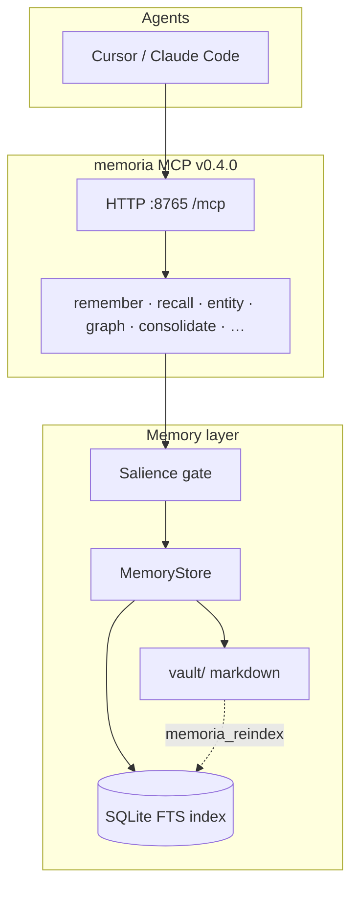
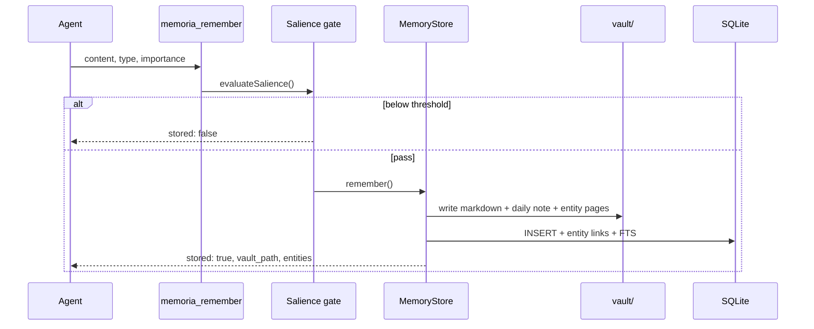
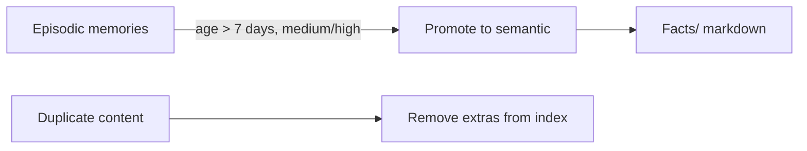

# Memoria Architecture

Human-like selective memory for AI agents, inspired by the **Complementary Learning Systems (CLS)** theory from cognitive neuroscience.

**Version:** memoria-mcp 0.4.0 · **Repo:** https://github.com/erwinpangilinan-dot/memoria

---

## 1. Design goals

| Goal | How Memoria achieves it |
|------|-------------------------|
| **Selective storage** | Salience gate rejects noise; agents don't dump chat logs |
| **Human-readable** | Markdown vault with wikilinks — you browse and edit directly |
| **Agent-accessible** | MCP tools for remember / recall / entity lookup |
| **Durable** | Disk-backed vault + SQLite index; always-on HTTP service |
| **Inspectable** | Graph, daily notes, entity pages with backlinks |

---

## 2. CLS inspiration

The [Complementary Learning Systems](https://en.wikipedia.org/wiki/Complementary_Learning_Systems_theory) theory proposes two interacting memory systems:

| Biological system | Role | Memoria equivalent |
|-------------------|------|-------------------|
| **Hippocampus** | Fast encoding of specific episodes (what/when/where) | **Episodic** memories → `Episodes/`, `Memory/Daily/` |
| **Neocortex** | Slow integration of general facts and schemas | **Semantic** memories → `Facts/`, `People/`, `Projects/` |
| **Consolidation** (e.g. sleep) | Replay hippocampal traces into cortical knowledge | **`memoria_consolidate`** — promote aged episodic → semantic |

Memoria is not a neural model. It borrows the **separation of concerns**: capture rich context quickly, distill durable facts over time, and recall using multiple signals (content, entities, recency, importance).

---

## 3. System overview



### Dual storage

Every stored memory writes to **both**:

1. **Markdown file** (`vault/…`) — source of truth for humans; YAML frontmatter holds `id`, `type`, `importance`, `entities`.
2. **SQLite row** (`vault/.memoria/index.db`) — FTS5 index, entity links, fast ranked recall.

Humans may edit vault files by hand; run `memoria_reindex` to sync back into SQLite (respects `.memoriaignore`).

---

## 4. Memory types

### Episodic

Time-bound, contextual traces.

- **Examples:** “Keys on [[kitchen counter]]”, session notes, today's events
- **Vault paths:** `Episodes/YYYY-MM-DD-slug.md`, appended to `Memory/Daily/YYYY-MM-DD.md`
- **When to use:** `memory_type: episodic` in `memoria_remember`

### Semantic

Durable facts and preferences.

- **Examples:** “[[Erwin Pangilinan]] is an Engineer in the Telecom Industry”, “Favorite number is 7”
- **Vault paths:** `Facts/slug.md`, entity stubs in `People/` or `Projects/`
- **When to use:** `memory_type: semantic` (default)

---

## 5. Encode path (remember)



### Salience gate (threshold 0.45)

Bypassed when `force: true` or `importance: high`.

| Signal | Score |
|--------|-------|
| `importance: medium` | +0.25 |
| `importance: low` | +0.05 |
| ≥ 6 words | +0.15 |
| Has `[[wikilinks]]` | +0.25 |
| `memory_type: semantic` | +0.10 |
| Keywords (birthday, prefers, deadline, …) | +0.35 |

Duplicate exact content is rejected without storing again.

---

## 6. Recall path

Multi-signal ranking (implemented in `store.js`):

| Signal | Weight | Source |
|--------|--------|--------|
| Full-text search | 45% | SQLite FTS5 (`memories_fts`) |
| Entity match | 30% | `entities` + `memory_entities` |
| Recency | 15% | Exponential decay (~30-day half-life) |
| Importance | 10% | high / medium / low |

Candidate pools: FTS → entity name match → LIKE fallback. Top-N returned to the agent.

**Entity lookup:** `memoria_entity(name)` returns all memories linked to a normalized entity (from wikilinks, `@handles`, or capitalized names).

---

## 7. Consolidation

`memoria_consolidate` implements a simplified CLS consolidation pass:



| Action | Rule |
|--------|------|
| **dedupe** | Same `content` string appears more than once — keep one row |
| **promote** | Episodic, medium/high importance, older than `min_age_days` (default 7), no semantic duplicate |
| **skip_promote** | Semantic fact already exists for same content |

Default is `dry_run: true`. Set `dry_run: false` to apply.

ponytail: promotion rewrites vault path to `Facts/` but leaves the old episodic file on disk; manual cleanup or a future job can remove orphans.

---

## 8. Vault UX

| Feature | Implementation |
|---------|----------------|
| **Wikilinks** | `[[Entity]]` in content → entity extraction + `People/` or `Projects/` stub with backlinks |
| **Daily notes** | Episodic entries append to `Memory/Daily/YYYY-MM-DD.md` |
| **Graph** | `memoria_graph` — entity↔memory edges + entity co-occurrence |
| **Ignore rules** | `vault/.memoriaignore` — excluded from `memoria_reindex` |
| **Session hook** | `sessionStart` → recall into `.memoria/session-context.md`; `sessionEnd` → daily note |

---

## 9. Deployment modes

| Mode | Entry | Use case |
|------|-------|----------|
| **stdio** | `packages/memoria-mcp/run.sh` | Cursor spawns process per session |
| **HTTP (always-on)** | `run-http.sh` + systemd | Survives reboot; Cursor connects via `http://127.0.0.1:8765/mcp` |

HTTP uses Streamable MCP transport with **per-session** transports so Cursor reconnects after restart without “already initialized” errors.

Install: `./scripts/install-memoria-service.sh`

---

## 10. MCP tool surface

| Tool | Role in architecture |
|------|---------------------|
| `memoria_remember` | Encode (with salience gate) |
| `memoria_recall` | Retrieve (multi-signal) |
| `memoria_entity` | Graph traversal from entity |
| `memoria_graph` | Full entity-memory graph |
| `memoria_daily` | Read episodic daily log |
| `memoria_reindex` | Vault → index sync |
| `memoria_consolidate` | Episodic → semantic promotion |
| `memoria_status` | Health / counts |

Agent workflows: `.cursor/skills/memoria/SKILL.md`

---

## 11. Data model (SQLite)

```
memories(id, type, content, importance, vault_path, created_at)
memories_fts → FTS5 on content
entities(id, name UNIQUE, created_at)
memory_entities(memory_id, entity_id)
```

Entity names are normalized lowercase. Wikilinks in content drive linking at store time and during reindex.

---

## 12. Known limits & future work

| Limit | Upgrade path |
|-------|--------------|
| Consolidation is rule-based, not semantic similarity | Embedding-based merge / summarization |
| Salience keywords are a fixed list | Learn from user `force` / reject patterns |
| No automatic consolidation schedule | systemd timer or cron calling consolidate |
| Entity `People/` vs `Projects/` is heuristic | Explicit type in wikilink or frontmatter |
| HTTP sessions accumulate in memory | Session TTL / cleanup on `DELETE /mcp` |
| Old episodic files after promote | Orphan cleanup in consolidate apply step |

---

## 13. References

- McClelland, McNaughton, O'Reilly (1995) — [Complementary Learning Systems](https://en.wikipedia.org/wiki/Complementary_Learning_Systems_theory)
- [Model Context Protocol](https://modelcontextprotocol.io/) — agent tool transport
- Project README: `../README.md`
- Agent skill: `../.cursor/skills/memoria/SKILL.md`
